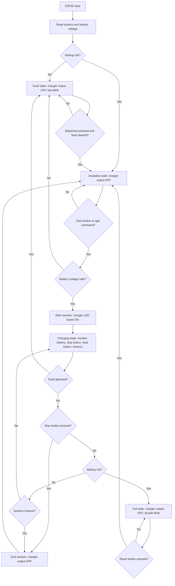

# ESP32 EV Charger Prototype

This firmware is for a low-voltage FYP demo, not a real EV charger. It uses an
ESP32, buttons, one LED board, and an optional rechargeable battery voltage
reading to demonstrate the EV charging flow.

Firebase is intentionally not connected in this version. The sketch has
`onSessionStarted()` and `onSessionEnded()` TODO hooks for the next step.

## Hardware

| Part | ESP32 pin | Notes |
| --- | --- | --- |
| Start button | GPIO 18 | Button to GND. Uses internal pullup. |
| Stop/reset button | GPIO 19 | Button to GND. Uses internal pullup. |
| Manual fault button | GPIO 23 | Button to GND. Uses internal pullup. |
| Status LED | GPIO 2 | Built-in LED on many ESP32 boards. |
| LED board / demo charger output | GPIO 26 | Drives LED board signal, MOSFET, or relay input. |
| Battery voltage ADC | GPIO 34 | Use voltage divider. Do not connect battery directly. |

For a single-cell Li-ion/LiPo battery voltage reading:

```text
Battery + ---- 100k ---- GPIO34 ---- 100k ---- GND
Battery - ------------------------------- GND
```

With this divider, `VOLTAGE_DIVIDER_RATIO` stays `2.0`.

Important: the ESP32 GPIO does not charge the battery. Use a proper charger and
protection module. The ESP32 should only read battery voltage and switch an LED
board or a safe demo load.

## Arduino Settings

Open `ev_charger_prototype.ino` in Arduino IDE.

Use:

```text
Board: ESP32 Dev Module
Upload speed: 115200 or 921600
Serial monitor: 115200 baud
```

If the battery voltage divider is not connected yet, change this line:

```cpp
constexpr bool USE_REAL_BATTERY_ADC = true;
```

to:

```cpp
constexpr bool USE_REAL_BATTERY_ADC = false;
```

That mode uses a software battery percentage so you can test the flow with only
buttons and the LED board.

## Flowchart Code

Paste this Mermaid code into a Mermaid renderer, Markdown preview, or diagrams
tool.



## Current Demo Behavior

- `Available`: status LED blinks slowly; LED board is off.
- Press `START`: session starts; LED board turns on.
- `Charging`: status LED pulses; serial monitor prints telemetry JSON.
- Press `STOP`: session ends; LED board turns off; state returns to available.
- Battery reaches full: session ends; state becomes full until reset.
- Press `FAULT`: charger output turns off and state becomes fault.
- Press `STOP` in fault: reset back to available.

## Firebase Next Step

The mobile app currently models:

- `/ev_stations/{id}.status`: `available`, `inUse`, or `offline`
- `/ev_stations/{id}.currentSessionId`
- `/ev_sessions/{id}` for active/completed charging history

When Firebase is ready, connect the firmware or backend through these hooks:

```cpp
void onSessionStarted() {
  // Mark station as inUse and create session.
}

void onSessionEnded(const char* reason) {
  // Complete session and mark station available/offline.
}
```

For production, prefer ESP32 -> backend/API -> Firebase instead of writing
directly from the ESP32 to Firestore. That keeps credentials and authorization
rules safer.
